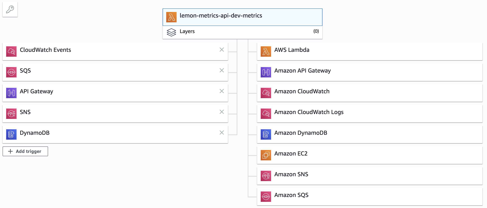
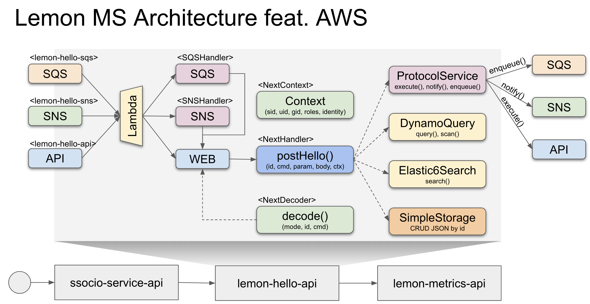
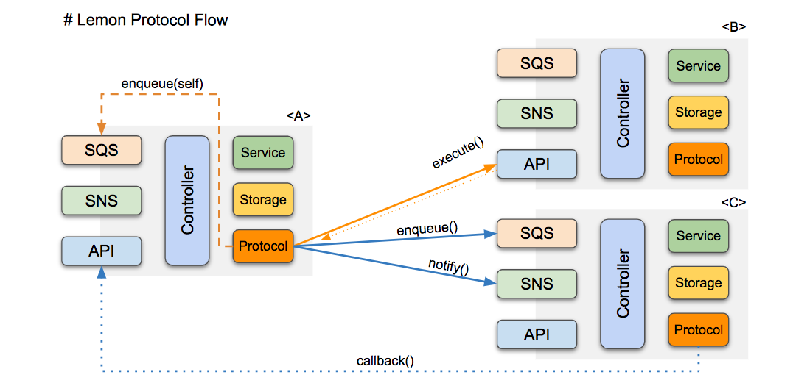

[](https://travis-ci.org/lemoncloud-io/lemon-core)
[](https://codecov.io/gh/lemoncloud-io/lemon-core)
[](https://badge.fury.io/js/lemon-core)
[](https://badge.fury.io/gh/lemoncloud-io%2Flemon-core)


# lemon-core

Lemon Core Bootloader for Serverless Micro-Service

- Support `multiple` event sources with single lambda function as below figure.
- Fully support `typescript` types (80%).
- Support Data Synchronization to `Elasticsearch` from `DynomoDB` via `DynamoStream`.

    


## Architecture

Basic MicroService Architecutre with `API` + `SNS` + `SQS`.

- `NextHandler`: basic controller method to handle user service
- `NextDecoder`: mapper from `httpMethod + id + cmd` to `NextHandler`
- `NextContext`: initial requester's context with `identity`.

    


### Protocol Service

- support inter-communication between micro services
- `execute()`: synchronized call via lambda execution by `API` Handler.
- `notifiy()`: async call by `SNS` handler w/ lambda callback.
- `enqueue()`: async call by `SQS` handler w/ lambda callback.
- `broadcast()`: publish message via `SNS`, and handled by `Notification` handler.

    

```ts
import $engine, { ProtocolParam, ProtocolService, CallbackParam } from 'lemon-core';
// use the internal instance from $engine.
const service: ProtocolService = $engine.cores.protocol.service;
const protocol: ProtocolParam = service.fromURL(context, 'api://lemon-hello-api/hello/echo', param, body);
const callback: CallbackParam = { type: 'hooks', id: `${id}` };
// queue protocol in 30 seconds delayed.
const queueId = await service.enqueue(protocol, callback, 30);
```

## Usage

1. install `lemon-core` module (>= 2.1.0).

```sh
$ npm install lemon-core --save
```

TODO - TBD in detail.


## Contribution

Plz, request PR. 

See [CODE_OF_CONDUCT](CODE_OF_CONDUCT.md)


## LICENSE

[MIT](LICENSE) - (C) 2019 LemonCloud Co Ltd. - All Rights Reserved.


----------------
# TODO TASK #

- [ ] use environ as default region like `ap-northeast-2` (or use current region).
- [x] draw protocol's sequence diagram w/ `callback` mechanism.
- [x] on protocol, use local account name as accountId for NextContext.
- [x] for protocol.enqueue(), use the optional delayed wait time.
- [ ] notification-handler is directly subscribed to `SNS` like `lemon-hello-out`.
- [ ] for protocol.brodcast(), use `SNS` to receive events (along with https) @200121


----------------
# VERSION INFO #

| Version   | Description
|--         |--
| 2.2.20    | cleanse and move an extra feature from `aws-s3-service` to 'lemon-images-api'
| 2.2.19    | fix an issue and add filtering feature for `ES6 autocomplete search`.
| 2.2.18    | support `$U.jwt(passcode).encode(...)` w/ `jsonwebtoken`.
| 2.2.16    | hot-fix `utf8 encoding of json` in `AWS.S3`.
| 2.2.15    | hot-fix `Cannot read property 'setIndex' of null` in `Dynamo`.
| 2.2.14    | support `CacheService`, and support appending entry into list in `Dynamo`.
| 2.2.13    | improve `LambdaWEBHandler` to support custom web-response including headers.
| 2.2.12    | fix `AWSS3Service` to use pure JS image library because of AWS compatibility issue
| 2.2.11    | improve `AWSS3Service` by adding handy method and metadata+tag handling
| 2.2.10    | fix `Access-Control-Allow-Origin` w/ `Access-Control-Allow-Credentials: true`.
| 2.2.9     | support `content-type:application/x-www-form-urlencoded` form data.
| 2.2.8     | minor changes.
| 2.2.7     | fix `status is not defined`.
| 2.2.6     | improve `search`, and support `cookie` in NextContext.
| 2.2.5     | add `Access-Control-Allow-Headers` for CORS.
| 2.2.4     | update package modules `npm update --save`.
| 2.2.3     | support `x-lemon-language` header in identity.
| 2.2.2     | fix result of sns/sqn event handler
| 2.2.1     | fix missing export of a class declaration.
| 2.2.0     | support `AbstractManager` for the template of model managers.
| 2.1.17    | support `filter()` in DynamoStream.
| 2.1.16    | improve `lock()` w/ 404 error, and `.aggregations` in QueryResult.
| 2.1.15    | support `$U.FN()`for float-number.
| 2.1.14    | support `hash` param for `MocksAPIService`.
| 2.1.13    | support `HttpStorage`, `$U.crypto2`, and `/favicon.ico`.
| 2.1.12    | support `userAgent` in NextContext.
| 2.1.11    | improve `syncToElastic6`, and `DynamoScanService`.
| 2.1.10    | support `loadProfile()`, and lookup-id style.
| 2.1.9     | improve `lock()` and `search()`.
| 2.1.8     | improve `express` of request-context.
| 2.1.7     | improve `TypedStorageService` w/ `save()`.
| 2.1.5     | support `GeneralAPIController` along w/ `UniqueFieldManager`.
| 2.1.4     | optimized `ProtocolService` w/ callback.
| 2.1.3     | support `asNextIdentityAccess()` for access identity.
| 2.1.2     | support `ProxyStorageService` for shared common storage.
| 2.1.1     | support `enqueue()` with delayed-seconds.
| 2.1.0     | support `ProtocolService` for inter communication of micro-services.
| 2.0.10    | show current name/version by `GET /`.
| 2.0.9     | improve `Elastic6Service` + `Elastic6QueryService`.
| 2.0.8     | improve `APIService` w/ mocks data.
| 2.0.7     | improve `StorageService` along w/ dummy-storage-service.
| 2.0.6     | support `CoreWEBController`, and `lambda.cores.web.addController(...)`
| 2.0.5     | support `APIService`, and fix `engine.initialize()`
| 2.0.4     | improve test-helper w/ `environ`, `credentials`
| 2.0.3     | support `StorageService` along with `DynamoStorageService`
| 2.0.2     | refactoring, and support `ProtocolService`
| 2.0.1     | fix package dependencies.
| 2.0.0     | remove `lemon-engine`, and support `typescript` fully.
| 1.2.15    | improve `doReportError` with error message
| 1.2.12    | support `doReportMetric()` for saving metric data.

