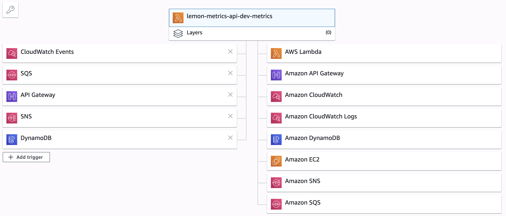
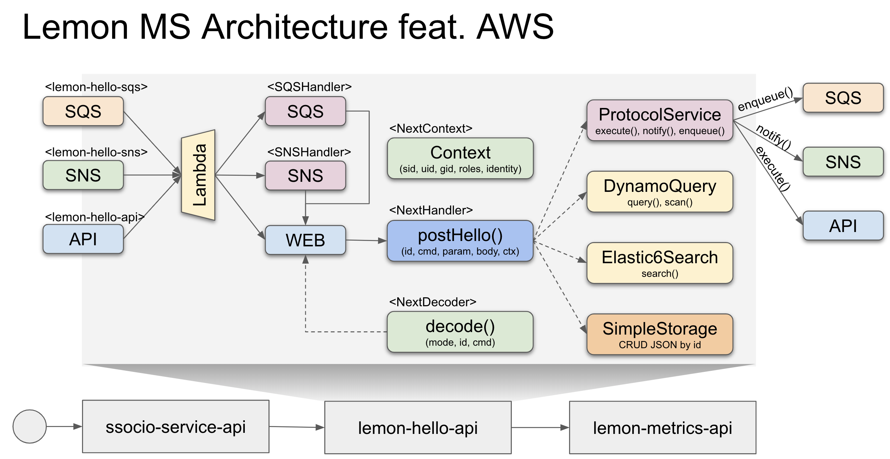
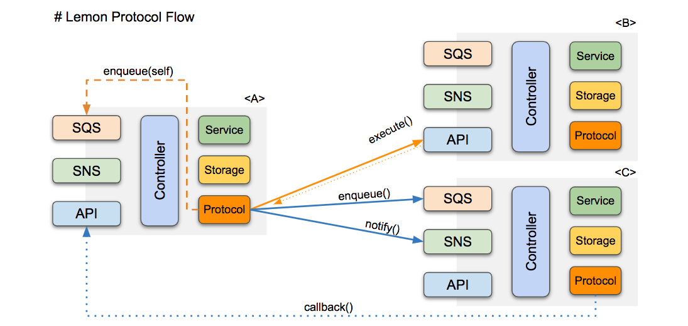

[](https://codecov.io/gh/lemoncloud-io/lemon-core)
[](https://badge.fury.io/js/lemon-core)
[](https://badge.fury.io/gh/lemoncloud-io%2Flemon-core)

# lemon-core / V4

Lemon Core Bootloader for Serverless Micro-Service

- Support `multiple` event sources with single lambda function as below figure.
- Fully support `typescript` types (80%).
- Support Data Synchronization to `Elasticsearch` from `DynomoDB` via `DynamoStream`.
- The way to migrate v3 to v4: SEE [HOW_TO_UPGRADE_V4](HOW_TO_UPGRADE_V4.md)

    

## Architecture

Basic MicroService Architecutre with `API` + `SNS` + `SQS`.

- `NextHandler`: basic controller method to handle user service
- `NextDecoder`: mapper from `httpMethod + id + cmd` to `NextHandler`
- `NextContext`: initial requester's context with `identity`.

    

### Protocol Service

- support inter-communication between micro services
- `execute()`: synchronized call via lambda execution by `API` Handler.
- `notifiy()`: async call by `SNS` handler w/ lambda callback.
- `enqueue()`: async call by `SQS` handler w/ lambda callback.
- `broadcast()`: publish message via `SNS`, and handled by `Notification` handler.

    

```ts
import $engine, { ProtocolParam, ProtocolService, CallbackParam } from 'lemon-core';
// use the internal instance from $engine.
const service: ProtocolService = $engine.cores.protocol.service;
const protocol: ProtocolParam = service.fromURL(context, 'api://lemon-hello-api/hello/echo', param, body);
const callback: CallbackParam = { type: 'hooks', id: `${id}` };
// queue protocol in 30 seconds delayed.
const queueId = await service.enqueue(protocol, callback, 30);
```

## Usage

### 1. Install

```sh
npm install lemon-core --save
```

Requires Node `>=24.0.0` (`package.json#engines.node`).

### 2. Minimal bootstrap — engine initialization

Importing `lemon-core` creates the `$engine` singleton immediately at module
load time (not lazily):

```ts
// src/engine/index.ts:23
//   export const $engine: LemonEngine = buildEngine(global, { env: process.env });
// src/engine/index.ts:26,30-32
//   export const $U = $engine.U;
//   export const _log = $engine.log; export const _inf = $engine.inf; export const _err = $engine.err;
import { $U, _log, _inf, _err } from 'lemon-core';

_inf('lemon-core loaded, NS=', $U.env('NS', 'TT'));
```

The root package also exposes a default export that bundles the four
top-level groups (`engine`, `cores`, `tools`, `controllers`):

```ts
// src/index.ts:68 — export default { engine, cores, tools, controllers };
import $lemon from 'lemon-core';

await $lemon.engine.initialize(); // resolves once every registered module's initModule() settles
```

### 3. Engine module registration — the "3-piece set"

Any module that hangs off `$engine` (built-in or your own) follows the same
contract: register in the constructor, name itself, expose an init level.
The built-in `ProtocolModule` is the smallest real example:

```ts
// src/cores/protocol/index.ts:16-34
// export class ProtocolModule implements EngineModule {
//     public constructor(engine?: LemonEngine) {
//         this.engine = engine || $engine;
//         if (this.engine) this.engine.register(this);      // (1) register
//     }
//     public readonly service: ProtocolService = new MyProtocolService();
//     public getModuleName = () => 'protocol';               // (2) name
//     public async initModule(level?: number): Promise<number> { // (3) init level
//         const $conf = this.engine.module<ConfigModule>('config');
//         if (level === undefined) return $conf ? (await $conf.initModule()) + 1 : 1;
//     }
// }
// export default new ProtocolModule();   // <- import-time instance, not lazy
```

`cores/index.ts:33` re-exports it as part of the `cores` default group
(`export default { aws, config, lambda, protocol }`), which is why the
existing `$engine.cores.protocol.service` example below resolves.

### 4. Manager / proxy registration — inter-service call example

`ProtocolService` (registered above) is the mechanism for calling another
micro-service — synchronously via `execute()`, or asynchronously via
`notify()` / `enqueue()` / `broadcast()`:

```ts
// import path verified: root barrel re-exports src/cores/core-services.ts
// (ProtocolParam: :99, CallbackParam: :88, ProtocolService: :150)
import $engine, { ProtocolParam, ProtocolService, CallbackParam } from 'lemon-core';

const service: ProtocolService = $engine.cores.protocol.service;
const protocol: ProtocolParam = service.fromURL(context, 'api://lemon-hello-api/hello/echo', param, body);
const callback: CallbackParam = { type: 'hooks', id: `${id}` };
// queue protocol in 30 seconds delayed.
const queueId = await service.enqueue(protocol, callback, 30);
```

For model persistence, lemon-core's storage/model layer (see the class table
below) is meant to be **subclassed**, not used directly — `AbstractManager`
and `MyCoreService` are abstract:

```ts
// class contracts (all exported from the root barrel):
// - CoreService            src/extended/abstract-service.ts:115  (table/ns/idName, makeStorageService())
// - AbstractManager        src/cores/storage/model-manager.ts:23  (storage owner; must implement
//                          `protected abstract prepareDefault($def: T): T` — model-manager.ts:66)
// - MyCoreService          src/extended/cores/abstract-services.ts:171
//                          (adds `guardProxy(context, cb)` — auto-saves via `proxy.saveAllUpdates()`
//                          on both success and throw — abstract-services.ts:189-202)
// - MyCoreProxy            src/extended/cores/abstract-services.ts:912
// - ManagerProxy           src/extended/abstract-service.ts:399  (auto-registers via `proxy.register(this)`
//                          in its own constructor — abstract-service.ts:406)
// - AbstractProxy          src/extended/abstract-service.ts:652  (container; `saveAllUpdates()` persists
//                          every registered ManagerProxy's changes in one call)
// - NextContext            re-exported from the `lemon-model` package via
//                          `export * from 'lemon-model';` — src/cores/index.ts:12

class MyService extends MyCoreService<MyModel, 'my-type', MyProxy> {
    createProxy(context: NextContext): MyProxy {
        return new MyProxy(context, this);
    }
}

// typical call site:
const result = await service.guardProxy(context, async proxy => {
    // read/modify via proxy.<manager>.get()/.set() ...
    return something;
}); // saveAllUpdates() runs automatically, even if the callback throws
```

This is a skeleton, not a runnable app — see the reference links below for a
worked model + manager + proxy example.

### 5. Run tests

```sh
LS=1 vitest run
```

(exact value of `package.json#scripts.test`, 2026-09-02)

### 6. Reference

- Full `ProtocolService` surface: `src/cores/core-services.ts`.
- Storage/model layer: `src/extended/abstract-service.ts`,
  `src/extended/cores/abstract-services.ts`, `src/cores/storage/model-manager.ts`.
- Generated API docs: *(typedoc output — link TBD, see B1 re-review doc,
  item 5 "API 문서 공개 전략"; current CI publishes to both an S3 bucket and
  `gh-pages` with no README link — not resolved in this draft)*.
- `docs/header-identity-token.md` (existing hand-written doc in this repo).

## Contribution

Plz, request PR.

See [CODE_OF_CONDUCT](CODE_OF_CONDUCT.md)

## LICENSE

[MIT](LICENSE) - (C) 2019 LemonCloud Co Ltd. - All Rights Reserved.

----------------

## VERSION INFO

| Version   | Description
|--         |--
| 4.3.0     | embed cores template layer as extended/cores
| 4.2.6     | optimized `$protocol.execute()` to support async lambda invocation.
| 4.2.5     | optimized `isBase64Encoded` to support apigwBinary. (from `4.1.17`)
| 4.2.4     | optimized `doReportError` to ignore in local dev. (from `4.1.16`)
| 4.2.3     | optimized `ManagerProxy.inc()` w/ `string[]` parameters.
| 4.2.2     | optimized `StorageService.increment()` w/ `string[]` parameters.
| 4.2.1     | optimized `storage-service` w/ `dummy` service (+ audit fix).
| 4.2.0     | optimized `node@24.15.0` w/o `ttypescript` + `jest`.
| 4.1.12    | optimized `synchronizer` w/o `elastic` config.
| 4.1.12    | optimized `@aws-sdk` w/ version `3.971.0`.
| 4.1.11    | optimized `proxy.mget` w/ `error-reporting` option.
| 4.1.9     | optimized `proxy.mget` w/ `getaddrinfo` error.
| 4.1.5     | optimized `saveAllUpdates` w/ failed model as cause.
| 4.1.2     | optimized `asErrorPayload` w/ env[`MY_PARALLEL_THROW`].
| 4.1.0     | optimized `DynamoService.mreadItem()` along with `lemon-model@1.1.1`
| 4.0.8     | optimized `findKMSService()` w/ shared pool storage.
| 4.0.7     | optimized `verifyJWT()` w/ more detail error.
| 4.0.6     | optimized `loadProfile()` as sync call.
| 4.0.5     | improve `$protocol` w/ `lambda` invoke.
| 4.0.0     | optimized with `nodejs22`.
| 3.2.16    | improve `ALBHandler` to support `elb` event.
| 3.2.15    | improve `NextContext` to support `referer` and `origin` header.
| 3.2.13    | improve `createSigV4Proxy()` to support the sig-v4 request to AWS.
| 3.2.12    | improve `buildResponse()` to determin content-type of html.
| 3.2.11    | updated `elastic6-service` to support `SearchProxy`.
| 3.2.10    | updated `elastic6-service` to fix `400 ILLEGAL ARGUMENT` (script parsing).
| 3.2.9     | improve `elastic6-service` w/ latest open-search.
| 3.2.8     | updated `ttypescript^1.5.15`, and optimized.
| 3.2.7     | cleanup log message in `AWSS3Service`, and optimized.
| 3.2.6     | improve `listObjects()` in `AWSS3Service` w/ prefix.
| 3.2.5     | improve `doReportError` in `lambda-web-handler`.
| 3.2.4     | updated with `lemon-model@1.0.2`.
| 3.2.3     | support `ES7.10`, and improve sync to elastic.
| 3.2.1     | improve `getIdentityId()` w/ `env:LOCAL_ACCOUNT`.
| 3.2.0     | upgrade all packages, and clear `audit fix`.
| 3.1.2     | refactoring with `lemon-model@1.0.0` for shared types.
| 3.1.1     | support `ManagerProxy`, `AbstractProxy` and `$ES6`. (`x-lemon-identity` as WebToken)
| 3.1.0     | upgrade `typescript^4.6.2`, and optimized.
| 3.0.2     | support `helpers` like `$T`.
| 3.0.0     | improve search-client with `@elastic/elasticsearch@7.12` to support AWS `OpenSearch 1.1` (compartible with `ES6.2`).
| 2.2.20    | improve an extra feature from `aws-s3-service` to 'lemon-images-api'
| 2.2.19    | improve search filtering feature for `ES6 autocomplete search`.
| 2.2.18    | support `$U.jwt(passcode).encode(...)` w/ `npm`.
| 2.2.16    | hot-fix `utf8 encoding of json` in `AWS.S3`.
| 2.2.15    | hot-fix `Cannot read property 'setIndex' of null` in `Dynamo`.
| 2.2.14    | support `CacheService`, and support appending entry into list in `Dynamo`.
| 2.2.13    | improve `LambdaWEBHandler` to support custom web-response including headers.
| 2.2.12    | improve `AWSS3Service` to use pure JS image library because of AWS compatibility issue.
| 2.2.11    | improve `AWSS3Service` by adding handy method and metadata+tag handling
| 2.2.10    | improve `Access-Control-Allow-Origin` w/ `Access-Control-Allow-Credentials: true`.
| 2.2.9     | support `content-type:application/x-www-form-urlencoded` form data.
| 2.2.6     | improve `search`, and support `cookie` in NextContext.
| 2.2.5     | support `Access-Control-Allow-Headers` for CORS.
| 2.2.3     | support `x-lemon-language` header in identity.
| 2.2.0     | support `AbstractManager` for the template of model managers.
| 2.1.17    | support `filter()` in DynamoStream.
| 2.1.16    | improve `lock()` w/ 404 error, and `.aggregations` in QueryResult.
| 2.1.14    | support `hash` param for `MocksAPIService`.
| 2.1.13    | support `HttpStorage`, `$U.crypto2`, and `/favicon.ico`.
| 2.1.12    | support `userAgent` in NextContext.
| 2.1.11    | improve `syncToElastic6`, and `DynamoScanService`.
| 2.1.10    | support `loadProfile()`, and lookup-id style.
| 2.1.8     | improve `express` of request-context.
| 2.1.7     | improve `TypedStorageService` w/ `save()`.
| 2.1.5     | support `GeneralAPIController` along w/ `UniqueFieldManager`.
| 2.1.3     | support `asNextIdentityAccess()` for access identity.
| 2.1.2     | support `ProxyStorageService` for shared common storage.
| 2.1.1     | support `enqueue()` with delayed-seconds.
| 2.1.0     | support `ProtocolService` for inter communication of micro-services.
| 2.0.10    | support to display the current name/version by `GET /`.
| 2.0.9     | improve `Elastic6Service` + `Elastic6QueryService`.
| 2.0.8     | improve `APIService` w/ mocks data.
| 2.0.7     | improve `StorageService` along w/ dummy-storage-service.
| 2.0.6     | support `CoreWEBController`, and `lambda.cores.web.addController(...)`
| 2.0.5     | support `APIService`, and fix `engine.initialize()`
| 2.0.3     | support `StorageService` along with `DynamoStorageService`
| 2.0.0     | improve `lemon-engine`, and support `typescript` fully.
| 1.2.15    | improve `doReportError` with error message
| 1.2.12    | support `doReportMetric()` for saving metric data.
